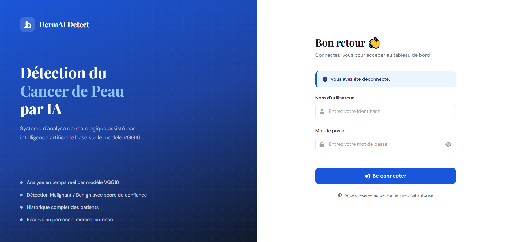
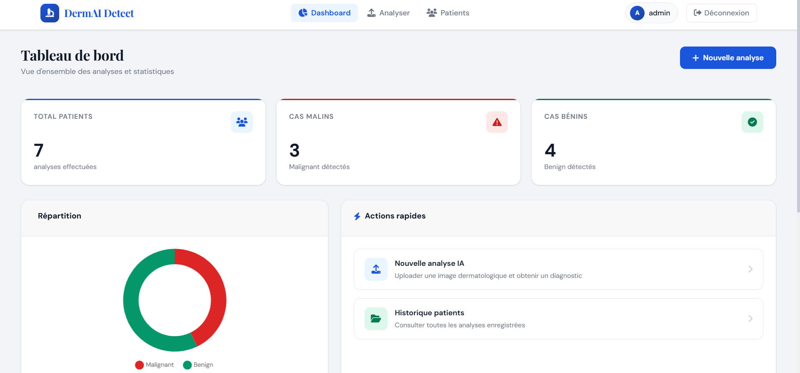
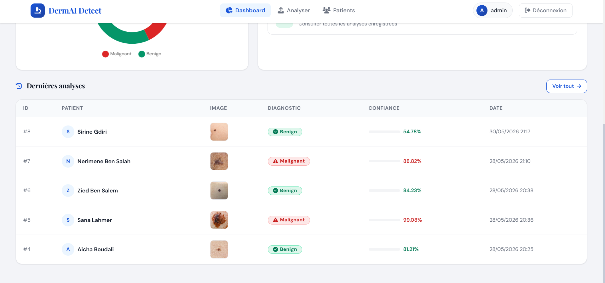
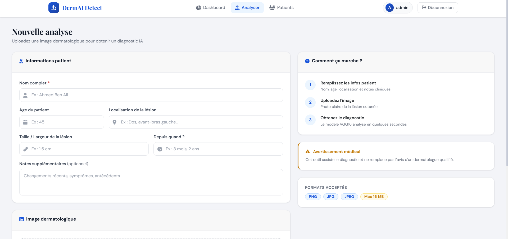
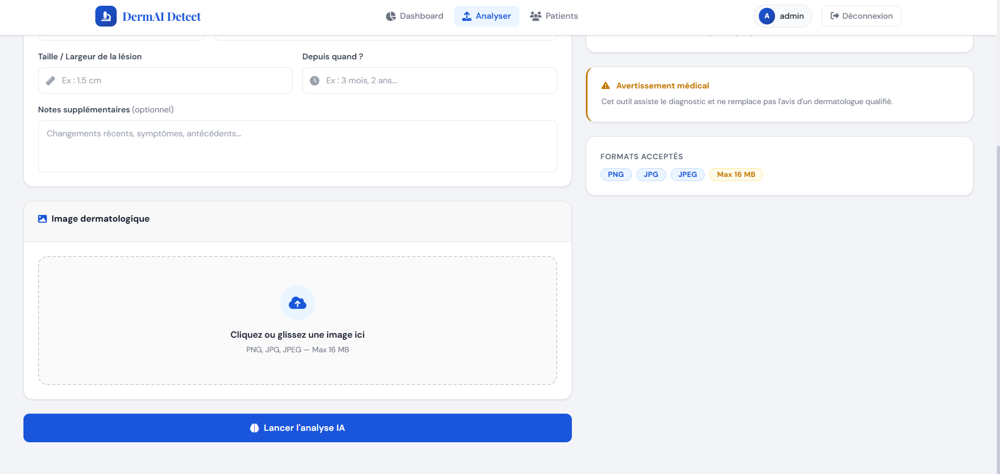
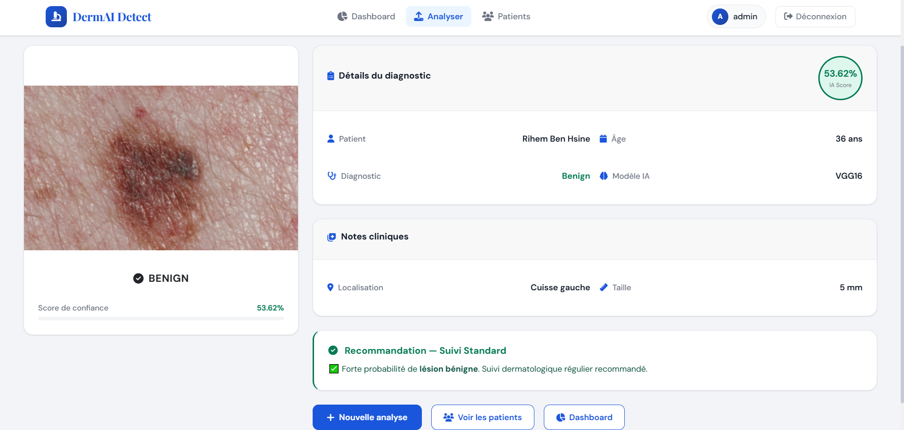
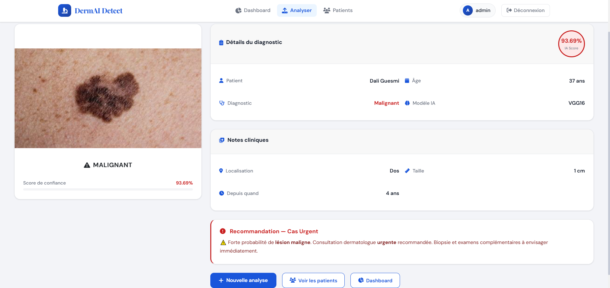
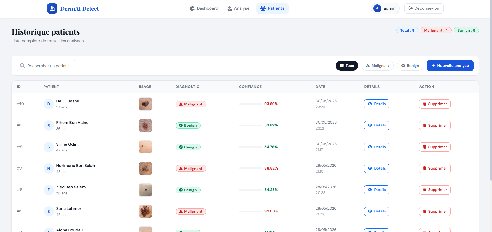
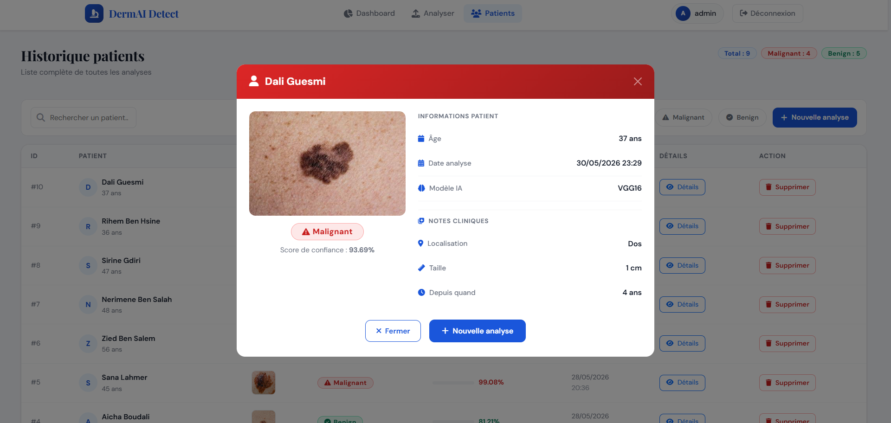

# 🔬 DermAI Detect — Skin Cancer Detection App


> Application web médicale de détection du cancer de peau par
> intelligence artificielle, basée sur le modèle **VGG16**.

---

## 📸 Captures d'écran

### 🔐 Page de connexion


### 📊 Tableau de bord



### 🧠 Analyse IA



### ✅ Résultat du diagnostic



### 👥 Historique patients



---

## 🏗️ Architecture du projet

```
SKIN_CANCER_APP/
│
├── model/
│   └── vgg16_malignant_vs_benign.h5   # Modèle VGG16 (non inclus)
│
├── static/
│   ├── style.css                       # Styles CSS
│   └── uploads/                        # Images uploadées
│
├── templates/
│   ├── login.html                      # Page connexion
│   ├── dashboard.html                  # Tableau de bord
│   ├── predict.html                    # Upload & analyse
│   ├── result.html                     # Résultat diagnostic
│   └── patients.html                   # Historique patients
│
├── screenshots/                        # Captures d'écran
├── app.py                              # Application Flask
├── database.sql                        # Script SQL
├── .gitignore
└── README.md
```

---

## ⚙️ Technologies utilisées

| Technologie | Rôle |
|---|---|
| **Flask** | Framework web Python |
| **TensorFlow 2.16 / Keras** | Modèle VGG16 |
| **MySQL** | Base de données |
| **Bootstrap 5** | Interface responsive |
| **Chart.js** | Graphiques statistiques |
| **Font Awesome 6** | Icônes |

---

## 🚀 Installation & Lancement

### 1. Cloner le projet
```bash
git clone https://github.com/maramnairi/skin-cancer-app.git
cd skin-cancer-app
```

### 2. Installer les dépendances
```bash
pip install flask tensorflow==2.16.1 mysql-connector-python werkzeug
```

### 3. Démarrer MySQL (XAMPP)
```
Ouvrir XAMPP → Start MySQL
```

### 4. Créer la base de données
```bash
Ouvrir phpMyAdmin → Importer database.sql
```

### 5. Configurer MySQL dans `app.py`
```python
def get_db_connection():
    return mysql.connector.connect(
        host='localhost',
        port=3307,        # ← port XAMPP
        user='root',
        password='',
        database='skin_cancer_db'
    )
```

### 6. Placer le modèle
```
model/vgg16_malignant_vs_benign.h5
```

### 7. Lancer l'application
```bash
python app.py
```

### 8. Ouvrir dans le navigateur
```
http://localhost:5000
```

---

## 🔐 Identifiants de test

| Champ | Valeur |
|---|---|
| Utilisateur | `admin` |
| Mot de passe | `1234` |

---

## 🤖 Modèle IA — VGG16

- **Architecture** : VGG16 (Transfer Learning)
- **Input** : Images 224×224 pixels normalisées
- **Output** : Probabilité binaire
  - `> 0.5` → **Malignant** 🔴
  - `≤ 0.5` → **Benign** 🟢
- **Confiance** : Score en pourcentage

---

## 📋 Fonctionnalités

-  Authentification login / logout
-  Upload sécurisé PNG, JPG, JPEG
-  Prétraitement automatique VGG16
-  Prédiction IA avec score de confiance
-  Notes cliniques (localisation, taille, durée)
-  Sauvegarde MySQL des résultats
-  Dashboard avec statistiques et graphique
-  Historique patients avec recherche et filtres
-  Suppression de patients
-  Modal détails par patient
-  Design médical responsive Bootstrap 5

---

## ⚠️ Avertissement médical

> Cet outil est destiné à **assister** le diagnostic médical
> et ne remplace pas l'avis d'un dermatologue qualifié.

---

## 👨‍💻 Auteur

Développé dans le cadre d'un projet académique de détection
du cancer de peau par intelligence artificielle.